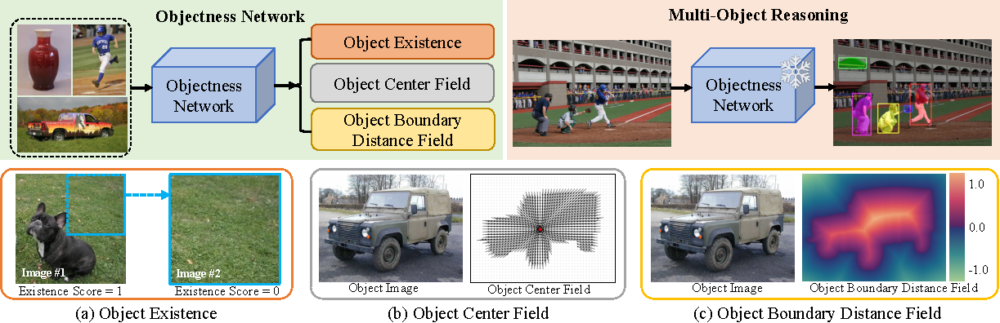
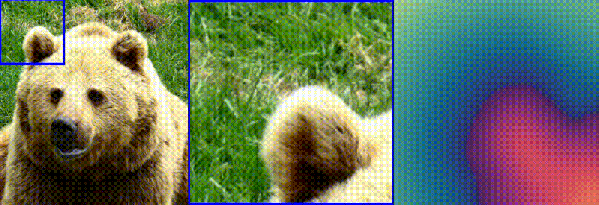
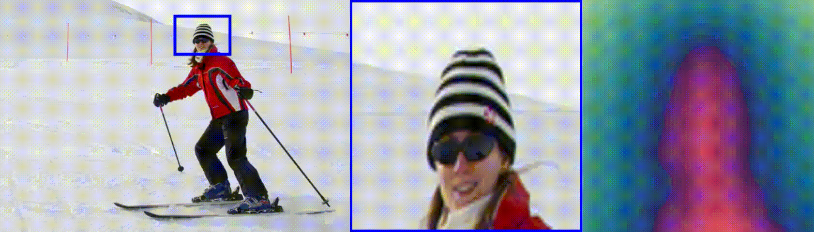
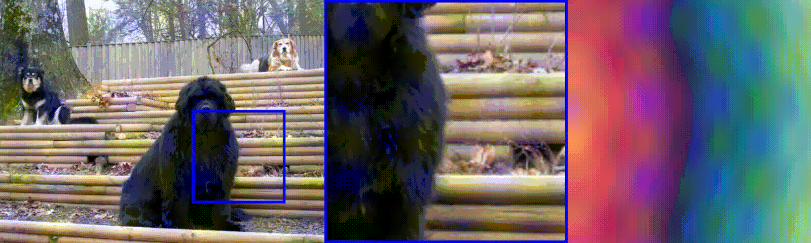
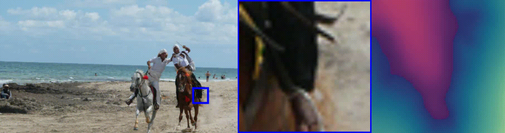

[](https://arxiv.org/abs/2506.01778)
[](https://creativecommons.org/licenses/by-nc-sa/4.0/legalcode)
[](https://twitter.com/vLAR_Group)

# unMORE: Unsupervised Multi-Object Segmentation via Center-Boundary Reasoning (ICML2025)
[Yafei Yang](https://yangyafei1998.github.io/), [Zihui Zhang](https://scholar.google.com.hk/citations?hl=en&user=jiwazT8AAAAJ&view_op=list_works&sortby=pubdate), [Bo Yang](https://yang7879.github.io/)

## Overview
We study the challenging problem of unsupervised multi-object segmentation on single images.
<p align="center">  </p>

In this paper, we introduce unMORE, a novel two-stage pipeline designed to identify many complex objects in real-world images. The key to our approach involves explicitly learning three levels of carefully defined object-centric representations in the first stage. Subsequently, our multi-object reasoning module utilizes these learned object priors to discover multiple objects in the second stage. 

## 1. Environment Setup
- Linux or macOS with Python ≥ 3.8
- PyTorch ≥ 1.13.1 and [torchvision](https://github.com/pytorch/vision/) that matches the PyTorch installation.
  Install them together at [pytorch.org](https://pytorch.org) to make sure of this. 
  Note, please check PyTorch version matches that is required by Detectron2.
- Detectron2: follow [Detectron2](https://detectron2.readthedocs.io/en/latest/tutorials/install.html) installation instructions.

Example conda environment setup:
```bash
conda create --name unMORE python=3.8 -y
conda activate unMORE
pip install torch==1.13.1+cu117 torchvision==0.14.1+cu117 torchaudio==0.13.1 --extra-index-url https://download.pytorch.org/whl/cu117

### install Detectron2 under your working directory
git clone git@github.com:facebookresearch/detectron2.git
cd detectron2
pip install -e .

cd unMORE
pip install -r requirements.txt
```
## 2. Data Preparation
### ImageNet
- ImageNet-1K (ILSVRC) can be downloaded from [here](https://image-net.org/download.php).

- Pseudo labels for ImageNet-1K generated by [VoteCut](https://arxiv.org/abs/2403.07700) can be downloaded: [VoteCut ImageNet-train](https://drive.google.com/uc?export=download&id=10vz02vuZV1ql1QoWmMQzSQrivsIOr7Ke).

- Use ```utils/preprocess_votecut.py``` to select the top-1 prediction (highest votecut confidence score) for each ImageNet image. 

The data structure should look like this:
```
imagenet/
  train/
    n01440764/*.JPEG
    n01443537/*.JPEG
    ...
  annotations/
    imagenet_train_votecut_kmax_3_tuam_0.2.json  # generated by VoteCut

  masks_top1_single_component/
    n01440764/*.png
    n01443537/*.png
    ...
```
### COCO, COCO20K, LVIS:
Download COCO 2017 from [here](https://cocodataset.org/#download). The expected
structure is:
```
coco/
  annotations/
    instances_{train,val}2017.json
    coco20k_trainval_gt.json
    coco_cls_agnostic_instances_val2017.json
    lvis1.0_cocofied_val_cls_agnostic.json
  {train,val}2017/
    000000000139.jpg
    000000000285.jpg
    ...
   train2014/
    COCO_train2014_000000581921.jpg
    COCO_train2014_000000581909.jpg
    ...
```
You can directly download COCO-style class-agnostic official annotations from here: [coco val](https://drive.google.com/uc?export=download&id=1gABmH0nAHDsZzFaC5X0t9k9FLoBbJdwb),
[coco20k](https://drive.google.com/uc?export=download&id=1Vam0DamGADy_rClswNCIDpheGhiPKmYf), 
[lvis](https://drive.google.com/uc?export=download&id=1FX1RnMTD6meJJnyg9SBParPm-jEKTBHD).

### COCO* Validation Set
COCO\* Validation Set is an augmented object annotations of COCO validation set (COCO val2017) with additional 197 object categories. 
The COCO-style annotations can be downloaded from: [COCO*_Val](https://1drv.ms/u/c/63dc39902c38c526/EfaKXyqw9CtFkkVfezJJ5p4BsXiyMT8AYBqp4xieq4f9Uw?e=IqcgDc), [COCO*_Val Class Agnostic](https://1drv.ms/u/c/63dc39902c38c526/ETtAPDtz67NGssUYk-MmRCwBPwFM7b3q0t1OpblJ5yiIFQ?e=exgXSC). The expected
structure with additional COCO* annotations is:
```
coco/
  annotations/
    instances_{train,val}2017.json
    coco20k_trainval_gt.json
    coco_cls_agnostic_instances_val2017.json
    lvis1.0_cocofied_val_cls_agnostic.json
    COCO_star_val2017.json
    COCO_star_val2017_cls_agnostic.json
  {train,val}2017/
    000000000139.jpg
    000000000285.jpg
    ...
   train2014/
    COCO_train2014_000000581921.jpg
    COCO_train2014_000000581909.jpg
    ...
```
The detailed labeling process can be found at [COCO* Labeling Details](#6-coco-labeling-details).
### KITTI:
```
kitti/
  annotations/
    trainval_cls_agnostic.json
  JPEGImages/
    001717.jpg
    ...
```
The pre-converted COCO-style annotation for [KITTI](https://www.cvlibs.net/datasets/kitti/eval_object.php?obj_benchmark=2d) can be downloaded [here](https://dl.fbaipublicfiles.com/cutler/kitti/trainval_cls_agnostic.json).
### VOC2007:
```
voc/
  annotations/
    trainvaltest_2007_cls_agnostic.json
  VOC2007/
    JPEGImages/
      000001.jpg
      ...
```
The pre-converted COCO-style annotation for [VOC2007](http://host.robots.ox.ac.uk/pascal/VOC/voc2012/index.html#devkit) can be downloaded [here](http://dl.fbaipublicfiles.com/cutler/voc/trainvaltest_2007_cls_agnostic.json).
### Objects365-V2:
```
objects365/
  annotations/
    zhiyuan_objv2_val_cls_agnostic.json
  val/
    000000000139.jpg
    000000000285.jpg
    ...
```
The pre-converted COCO-style annotation for [Objects365](https://www.objects365.org/download.html) can be downloaded [here](http://dl.fbaipublicfiles.com/cutler/objects365/zhiyuan_objv2_val_cls_agnostic.json).
### OpenImages-V6:
```
openImages/
  annotations/
    openimages_val_cls_agnostic.json
  validation/
    47947b97662dc962.jpg
    ...
```
The pre-converted COCO-style annotation for [OpenImages-V6](https://storage.googleapis.com/openimages/web/download_v6.html) can be downloaded [here](http://dl.fbaipublicfiles.com/cutler/openImages/openimages_val_cls_agnostic.json).

## 3. Objectness Model Training
- Train object center and boundary model:
```
CUDA_VISIBLE_DEVICES={gpu_id} python train_objectness_net.py --dataset ImageNet_votecut_top1_Dataset \
    --backbone_type dpt_large --optimizer adam --lr_scheduler_gamma 0.1 --learning_rate 0.0001 \
    --batch_size 20 --lr_scheduler_gamma 0.1 \
    --sdf_loss_type l1 --center_field_loss_type l2 --use_sdf_binary_mask_loss --use_sdf_gradient_loss --sdf_activation tanh --use_bg_sdf \
    --train_center_and_boundary
```
- Train object existence model:
```
CUDA_VISIBLE_DEVICES={gpu_id} python train_objectness_net.py --dataset ImageNet_votecut_top1_Dataset \
    --backbone_type dpt_large --optimizer adam --lr_scheduler_gamma 0.1 --learning_rate 0.0001 \
    --batch_size 20 --lr_scheduler_gamma 0.1 \
    --sdf_loss_type l1 --center_field_loss_type l2 --use_sdf_binary_mask_loss --use_sdf_gradient_loss --sdf_activation tanh --use_bg_sdf \
    --train_existence
```
The pretrain models can be downloaded from [center_boundary_model](https://1drv.ms/u/c/63dc39902c38c526/Ec1KkVOva9RPsfXFs8pACbgBVPJnBlxWYQKoZXv1kdMbfw?e=KGoei1), [existence_model](https://1drv.ms/u/c/63dc39902c38c526/EW21Rdlx5qZGnzKSUcbjJysBRUycLHmE-yb77QuZHgSCZQ?e=BhWjk4).

## 4. Object Reasoning

- Discovery objects from images:
```
CUDA_VISIBLE_DEVICES={gpu_id} python object_reasoning.py \
    --sdf_activation tanh --use_bg_sdf \
    --objectness_resume {center_boundary_model_path} \
    --binary_classifier_resume {existence_model_path} \
    --start_idx 0 \
    --end_idx 20 \
    --analyze_cc
```

- Score discovered objects:
```
CUDA_VISIBLE_DEVICES={gpu_id} python object_scoring.py \
    --sdf_activation tanh --use_bg_sdf \
    --objectness_resume {center_boundary_model_path} \
    --binary_classifier_resume {existence_model_path} \
    --start_idx 0 \
    --end_idx 20 \
    --raw_annotations_path {discovered_objects_json_file}
```

Object discovery results can be evaluted using ```COCO_evaluator/main.py```.

Object reasoning results for COCO val2017 and COCO train2017 can be downloaded from [unMORE_disc_coco_val17](https://1drv.ms/u/c/63dc39902c38c526/EUmx4T0dephAjOxNeNhoiEsBVy7hsElut_YJL3cRdPkhJw?e=wbkma5), [unMORE_disc_coco_train17](https://1drv.ms/u/c/63dc39902c38c526/EapUi5G_7vhBmht_klj6nDkBRYmpBvTdBgacpdA6Q9R7sA?e=TEQTOY).

## 5. Class Agnostic Detector Training

- Post-process objects for detector training:
```
python post_process.py \
    --pred_annotations_path {object_discovery_with_scores_json_file} \
    --existence_score_thres 0.5 \
    --center_score_thres 0.8 \
    --boundary_score_thres 0.75 \
    --dataset COCO \
    --split {test/train} 
```

- Merge unMORE_disc results on COCO train2017 ([download]()) with imagenet train (votecut) ([download](https://drive.google.com/uc?export=download&id=10vz02vuZV1ql1QoWmMQzSQrivsIOr7Ke)):
```
python merge_coco_and_imagenet.py \
    --coco_annotations_training_format_path {root_to_COCO_train2017_unMORE_disc_results} \
    --imagenet_annotations_training_format_path {root_to_votecut_imagenet_train_results}
```
The merged data can be downloaded from [cad_training_data](https://1drv.ms/u/c/63dc39902c38c526/EdYi4fl01ItInWR6gVRqDHYBE4vFHzNwfq_9NJmJzMGn4w?e=Ao99xN) and it will be used to train a Cascade R-CNN detector. 

- Train a Cascade R-CNN model using Detectron2:
```
CUDA_VISIBLE_DEVICES=1,2,3,4 python cad/train_net.py \
    --num-gpus 4 \
    --config-file cad/model_zoo/configs/unMORE-IN+COCO/cascade_mask_rcnn_R_50_FPN.yaml
```
Our trained model can be downloaded from [unMORE_model](https://1drv.ms/u/c/63dc39902c38c526/EXPiaGx7tQ9Nqg_1ej6IlKoBjMSbSjT0PG_dMaqxWFZw_g?e=9GDJce).

- Evaluate trained Cascade R-CNN model:
```
CUDA_VISIBLE_DEVICES=1,2 python cad/train_net.py \
    --config-file cad/model_zoo/configs/unMORE-IN+COCO/cascade_mask_rcnn_R_50_FPN.yaml \
    --num-gpus 2 \
    --eval-only \
    --test-dataset cls_agnostic_coco*_val_17 \
    MODEL.WEIGHTS {cad_model_path} \
    OUTPUT_DIR cad_eval/cls_agnostic_coco*_val_17
```
Evaluation results with provided checkpoint can be downloaded from [unMORE_coco_val17](https://1drv.ms/u/c/63dc39902c38c526/EapUi5G_7vhBmht_klj6nDkBRYmpBvTdBgacpdA6Q9R7sA?e=TEQTOY).

## 6. COCO* Labeling Details
- Step 1: Annotate the tightest bounding boxes for objects with [VGG Annotator](https://www.robots.ox.ac.uk/~vgg/software/via/via_demo.html).
- Step 2: Use [Segment Anything Model](https://github.com/facebookresearch/segment-anything) to generate binary object mask within each annotated bounding box:
```
cd COCO*
python utils/generate_mask_for_extra_coco_labels.py
```
Note that SAM models can be installed and downloaded according to the instructions in its original [repo](https://www.robots.ox.ac.uk/~vgg/software/via/via_demo.html).
The annotations for additional labeled objects (bounding box + mask) can be downloaded from [COCO*_extra](https://1drv.ms/u/c/63dc39902c38c526/EQ2D91J5uoJAsKcrSnNXMlABdkvYKkObEmnKcEadP06VFQ?e=YKwvB1).

- Step 3: Merge the newly annotation objects with original objects in COCO val2017 set:
```
cd COCO*
python utils/merge_extra_labels_with_original.py
``` 
The full COCO* validation set can be downloaded from: [COCO*_Val](https://1drv.ms/u/c/63dc39902c38c526/EfaKXyqw9CtFkkVfezJJ5p4BsXiyMT8AYBqp4xieq4f9Uw?e=IqcgDc), [COCO*_Val Class Agnostic](https://1drv.ms/u/c/63dc39902c38c526/ETtAPDtz67NGssUYk-MmRCwBPwFM7b3q0t1OpblJ5yiIFQ?e=exgXSC).

The category distribution can be found at: ```COCO*/category_stats.json```.
## 7. Download Summary

Table for results:

|    Model    |     Dataset    |            Results           |
|:-----------:|:--------------:|:----------------------------:|
| unMORE_disc |  COCO val2017  |  [unMORE_disc_coco_val17](https://1drv.ms/u/c/63dc39902c38c526/EUmx4T0dephAjOxNeNhoiEsBVy7hsElut_YJL3cRdPkhJw?e=wbkma5)  |
| unMORE_disc | COCO train2017 | [unMORE_disc_coco_train17](https://1drv.ms/u/c/63dc39902c38c526/EapUi5G_7vhBmht_klj6nDkBRYmpBvTdBgacpdA6Q9R7sA?e=TEQTOY) |
|    unMORE   |  COCO val2017  |     [unMORE_coco_val17](https://1drv.ms/u/c/63dc39902c38c526/EapUi5G_7vhBmht_klj6nDkBRYmpBvTdBgacpdA6Q9R7sA?e=TEQTOY)    |

Table for models:
|    Model    |       Type      |         Checkpoint        |
|:-----------:|:---------------:|:-------------------------:|
| unMORE_disc | Center_Boundary | [center_boundary_model](https://1drv.ms/u/c/63dc39902c38c526/Ec1KkVOva9RPsfXFs8pACbgBVPJnBlxWYQKoZXv1kdMbfw?e=KGoei1) |
| unMORE_disc |    Existence    |    [existence_model](https://1drv.ms/u/c/63dc39902c38c526/EW21Rdlx5qZGnzKSUcbjJysBRUycLHmE-yb77QuZHgSCZQ?e=BhWjk4)    |
|    unMORE   |  Cascade R-CNN  |      [unMORE_model](https://1drv.ms/u/c/63dc39902c38c526/EXPiaGx7tQ9Nqg_1ej6IlKoBjMSbSjT0PG_dMaqxWFZw_g?e=9GDJce)     |

Table for dataset annotations:
|                              |         Annotations for         | Class-Agnostic? |             Data             |
|:----------------------------:|:-------------------------------:|:---------------:|:----------------------------:|
|      COCO* extra labels      |           COCO val2017          |        No       |        [COCO*_extra](https://1drv.ms/u/c/63dc39902c38c526/EQ2D91J5uoJAsKcrSnNXMlABdkvYKkObEmnKcEadP06VFQ?e=YKwvB1)       |
|          COCO* Full          |           COCO val2017          |        No       |         [COCO*_Val](https://1drv.ms/u/c/63dc39902c38c526/EfaKXyqw9CtFkkVfezJJ5p4BsXiyMT8AYBqp4xieq4f9Uw?e=IqcgDc)        |
|   COCO* Full Class Agnostic  |           COCO val2017          |       Yes       | [COCO*_Val Class Agnostic](https://1drv.ms/u/c/63dc39902c38c526/ETtAPDtz67NGssUYk-MmRCwBPwFM7b3q0t1OpblJ5yiIFQ?e=exgXSC) |
| Trainining Data for Detector | COCO train2017 + ImageNet train |       Yes       |     [cad_training_data](https://1drv.ms/u/c/63dc39902c38c526/EdYi4fl01ItInWR6gVRqDHYBE4vFHzNwfq_9NJmJzMGn4w?e=Ao99xN)    |

## 8. More Visualization
Object boundary reasoning process:
<p align="center">
    
    <span style="display: inline-block; width: 1px; height: 120px; background-color: black; margin: 0 10px;"></span>
    
    <!-- 
    <span style="display: inline-block; width: 1px; height: 120px; background-color: black; margin: 0 10px;"></span>
     -->
</p>


## Acknowledgements
This project references the following repositories:
- [Cut and Learn for Unsupervised Image & Video Object Detection and Instance Segmentation](https://github.com/facebookresearch/CutLER/tree/main)
- [CuVLER: Enhanced Unsupervised Object Discoveries through Exhaustive Self-Supervised Transformers](https://github.com/shahaf-arica/CuVLER/tree/main)


## Citation
If you find our work useful for your research, please consider citing:

```
@article{yang2025unmore,
  title={unMORE: Unsupervised Multi-Object Segmentation via Center-Boundary Reasoning},
  author={Yang, Yafei and Zhang, Zihui and Yang, Bo},
  journal={ICML},
  year={2025}
}
```